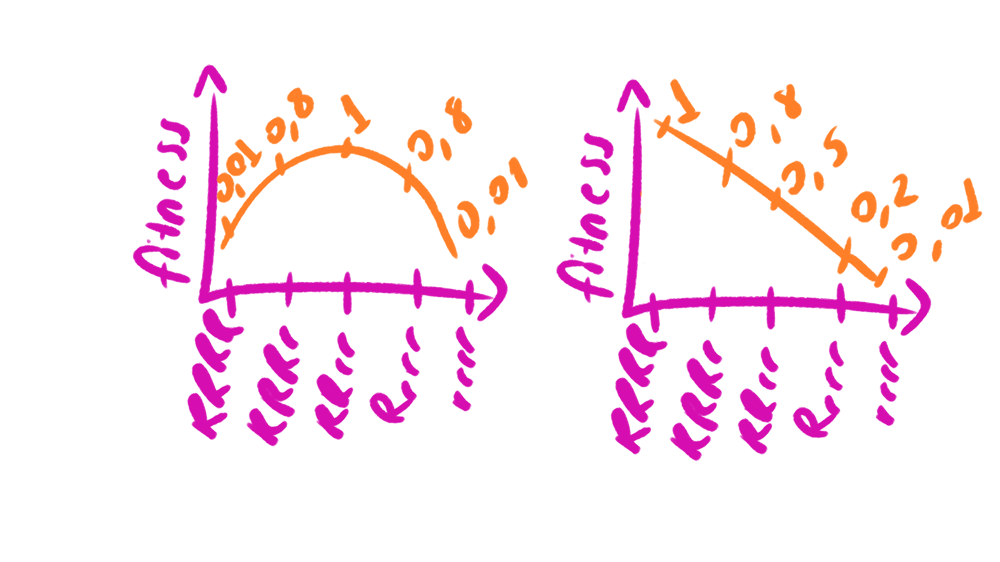
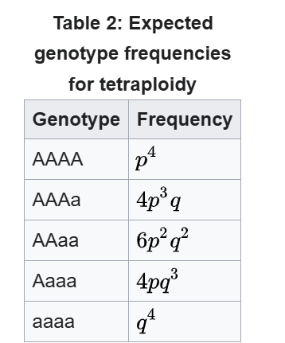

This notebook is meant to introduce you to simulations and calculations using R. In the following, we will simulate the evolutionary rescue model introduced in the lecture.

## Your tasks

Read through the code and execute it (using the "play" or "run" or "knit/preview" buttons - you might have to install some extra packages for the latter). Then "tackle" the following questions:

-   Do you understand what each line means? Which lines are (particularly) confusing?
-   Check out the questions following each code block and try to answer them.

## Troubleshooting

1.  If it all looks very confusing right now and you cannot answer any of the questions, do not despair! We will go through everything step by step during the practical and you will soon become familiar with such code. Note that we do **not** expect you to be able to answer all these questions today!
2.  If you cannot execute the code at all, tell us as soon as you can, so we can try to fix this together. Everyone should be able to run the code on their computer - it's not sufficient to peak onto your neighbor's screen.
3.  A great tool to understand what a line of code does is to print the output line by line, using the `print()` command. Be aware that in long loops this can create quite a mess of output.

------------------------------------------------------------------------

## Simulating evolutionary rescue in discrete time

In this notebook, we are implementing simulations of evolutionary rescue by a single mutation in discrete time, as discussed and analyzed in the work by Orr & Unckless. The model is as follows: a haploid population starts with a given number of wild-type and mutant individuals. Because of a sudden environmental change, the wild type is unfit and declines in the new environment. The mutant is beneficial and can survive and expand in the new environment, but it starts at a low (or zero) frequency in the total population. In order to rescue the population, it has to outcompete the wild type. If the mutant is not present at time 0, it has to appear through mutation and then spread in the population before extinction occurs.

## List of variables and parameters

-   $N_a$ current size of the wild-type (a) population (changes over time)
-   $N_A$ current size of the mutant (A) population (changes over time)
-   `N_init_a` initial population size of wild-type population (should be a positive integer)
-   `N_init_A` initial population size of the mutant population (should be a non-negative integer)
-   `decay_rate` detrimental effect of the environment on the wild type (i.e., the wild-type population decays at this rate; should be \>0 to induce potential extinction)
-   `sel_coeff` selective advantage of the mutant over the wild type (should be \>decay_rate to allow for evolutionary rescue)
-   `mut_rate` mutation rate from the wild type to the mutant genotype (should be \>0 and small)
-   `t_max` number of generations after which to stop the simulation (should be an integer \>0; this is not a model parameter but a setting for the simulations). In the code presented here, the simulation stops automatically if the population goes extinct, or if it recovers and exceeds 1.5 times the original total population size, so `t_max` can be set to a large value without creating extremely long simulation times.

## Simulate one generation of population size change

We want to observe the numbers of wild-type and mutant individuals over time. As first step, we simulate one generation of the population. At time $t$, the population has $N_a$ wild-type individuals and $N_A$ mutant individuals. First, these reproduce. This is modeled by drawing a Poisson random variable according to the expected absolute number $N_a \cdot (1-r)$ of wild-type individuals, where $r$ is the decay rate of the wild type, and $N_A \cdot (1-r+s)$ of mutant individuals, where $s$ is the selective advantage of the mutant over the wild time. Then mutation from $a$ to $A$ occurs as a Poisson random variable according to the given mutation rate. This defines the composition of the population at time $t+1$.

```{r}
simulate_one_gen <- function(N_a, N_A, decay_rate, sel_coeff, mut_rate) {
  # draw offspring according to Poisson distribution
  offsp_a <- rpois(1, N_a * (1-decay_rate))
  offsp_A <- rpois(1, N_A * (1-decay_rate+sel_coeff))
  # draw new mutants according to Poisson distribution
  mut_a_to_A <- rpois(1, offsp_a * mut_rate)
  
  # determine new population sizes of wild type and mutant
  N_a_new <- max(offsp_a - mut_a_to_A, 0)
  N_A_new <-  offsp_A + mut_a_to_A
  
  return(c(N_a_new, N_A_new))
}
# Test the function
print(simulate_one_gen(100,0,0.1,0.2,0.01))
```

### Questions

-   Why do we substract `mut_a_to_A` from `N_a_new` and not from `N_A_new`?
-   In the life cycle as defined above, do individuals reproduce first and then mutate, or vice versa?
-   Running the test output repeatedly, why do you almost always get mutant individuals in the next generation, even though you start without any mutants?
-   What does the function `c` do?

## Simulate a population trajectory

We can now track the dynamics of the population from one generation to another, but this is not enough. We want to follow the population from time 0 until it either is rescued or goes extinct. This is what the following function does.

```{r}
simulate_pop <- function(N_init_a, N_init_A, decay_rate, sel_coeff, mut_rate, t_max) {
  # Create the vector in which to save the results
  pop_vector <- c(N_init_a, N_init_A)
  # initiate the variables
  pop_new <- c(N_init_a, N_init_A)
  
  # run the simulation until generation t_max
  for (i in 1:t_max+1) {
    # redefine the current population one generation later
    pop_new <- simulate_one_gen(pop_new[1],pop_new[2], decay_rate, sel_coeff, mut_rate)
    # add the new population sizes to the output vector
    pop_vector <- rbind(pop_vector,pop_new)
    # condition to stop the simulation before t_max: either the population exceeds 1.5 times the original population size, or it goes extinct
    if (pop_new[1]+pop_new[2]>=1.5*(N_init_a+ N_init_A) | pop_new[1]+pop_new[2]==0) break
  }
  
  # define the row and column names of the output vector
  rownames(pop_vector) <- (0:t_max)[1:length(pop_vector[,1])] # note that the vector has to be cut if the simulation stopped early
  colnames(pop_vector) <- c("a","A")
  # return the result
  return(pop_vector)	
}
# Test the function and plot the result
# set t_max to a value to be used througout
max_gen <- 1000
# create your simulation data
output <- simulate_pop(100,0,0.1,0.2,0.01,max_gen)
# show the last few lines of the data table
print(tail(output))
# plot the output - note that the plot range and the x axis have to be adjusted based on the length of the table
# determine x axis range 
x_range <- 0:(length(output[,1])-1)
# this plots the total population size
plot(x_range,output[,1]+output[,2],type='l',ylim=c(0,max(output[,1]+output[,2])),xlab = "Generation",ylab = "Population size")
# add number of wild type individuals
lines(x_range,output[,1], col="blue")
# add number of mutant individuals
lines(x_range,output[,2], col="red")
```

### Questions

-   What is the difference between `pop_vector` and `pop_new`?
-   What is the condition that breaks the loop good for? What are its disadvantages?
-   What does the function `tail` do?

## A small analysis

As you can see if you simulate and plot the output several times, there is a lot of stochasticity/variation in the outcome. Therefore, to get interpretable results, we have to run the simulation many times and summarize the outcome depending on the question of our study. Here I am showing an example in which we record the time and the value of the lowest population size (or the time of extinction, if the population size eventually goes to 0). Usually, we want to study this for a range of model parameters; here I am varying the decay rate and the selection coefficient. Other (maybe more interesting) features to study would be the following:

-   rescue probability dependent on initial frequency and selection coefficient
-   time at which the rescue mutation occurs first if it rescues, vs. if it doesn't rescue, dependent on initial population size and mutation rate
-   time until the population has recovered in case it becomes rescued, dependent on mutation rate and selection coefficient
-   ...

```{r}
# set some parameters to fixed values
init_a <- 100
init_A <- 0
m_rate <- 0.001
max_gen <- 1000
# determine how often to run the simulation for each set of parameters
no_replicates <- 100

# set parameters to vary
s_values <- c(0.2,0.3,0.4)
r_values <- c(0.05,0.1,0.15)

# initialize data table - where to collect the results
data_table <- c()
# run the simulation across all chosen parameters
# loop over decay rates
for(rval in r_values){
  # loop over selection coefficients
  for(sval in s_values){
    # different way of running many simulations: make replicates using "repeat" function with a counter i
    # reset counter
    i<-1
    repeat {
      # increase counter by one
      i<-i+1
      # run the simulation once
      one_run <- simulate_pop(init_a,init_A,rval,sval,m_rate,max_gen)
      # determine total population sizes
      total_size <- one_run[,1]+one_run[,2]
      # determine minimum population size
      min_size <- min(total_size)
      # determine (first) generation at which this population size occurred
      min_gen <- as.numeric(which(total_size==min_size)[1])
      # enter the data into the table
      data_table <- rbind(data_table,c(rval,sval,min_gen,min_size)) # note that we add the varying parameters (decay rate and selection coefficient) to the table too
      # stop the repeated computation after no_replicates times
      if(i>no_replicates) break
    }
  }
}
# define column names of data table
colnames(data_table) <- c("r","s","min_gen","no_min")
# show the first lines of the output
print(head(data_table))
```

### Questions

-   Why does this code block run much more slowly than the others?
-   Why is it useful to define the parameters at the beginning (e.g. `init_a=100`) and use their names rather than the numbers throughout the rest of the code?
-   What does the function `which` do?

## Next steps

So, where do you go from here? Of course you won't just stare at these tables (at least not forever). Visualization would be a good step to see how the minimum population size varies with the decay rate and the selection coefficient. And you might want to include only the cases in which rescue happens, and also extract the rescue probability in parallel. However, the idea is that you pick a question that you find (more) interesting and implement modified versions of this code to address your question of choice.

---
title: "Herbicide resistance in the case of Tetraploidy"
author: "Rea and Aigerim"
date: "2024-10-15"
output:
  html_document:
    df_print: paged
---



### Variables:

Number of RRRR individuals

Number of RRRr individuals

Number of RRrr individuals

Number of Rrrr individuals

Number of rrrr individuals

### Parameters:

Herbicide pressure(decay rate)

Selecticon coefficent: Selective advantage of the heterozygote over other genotypes, its fitness

Selection coefficient(0.01, 0.8, 1, 0.8, 0.01)

Selection strength of RRRR individuals = 0.01

Selection strength of RRRr individuals = 0.8

Selection strength of RRrr individuals = 1

Selection strength of Rrrr individuals = 0.8

Selection strength of rrrr individuals = 0.01

Initial population size of RRRR individuals

Initial population size of RRRr individuals

Initial population size of RRrr individuals

Initial population size of Rrrr individuals

Initial population size of rrrr individuals

T_max = maximum generation number.


# simulating one generation in a diploid population


### first the mating function according to hardy weinberg
```{r}
### variables and parameters for diploid population
#Variables:
#N_RR_new = Number of RR individuals (>=0)
#N_Rr_new = Number of Rr individuals (>=0)
#N_rr_new = Number of rr individuals (>=0)
#number of generations

#Parameters:
#N_RR = initial number of RR individuals(>=0)
#N_Rr = initial number of Rr individuals(>=0)
#N_rr = initial number of rr individuals(>=0)
#decay_rate = power of herbicide application to kill individuals (>0 to have potential extinction)
#sel_coeffs = selective advantage of the genotypes over others. (has to be between 0 and 1) for 0.01 = low fitness, 0,2 = intermediate fitness,  0.5 = high fitness (should be bigger than decay rate for evolutionary rescue likelyness)
#mut_rate = mutation rate (>=0)

# Function to simulate random mating for diploid genotypes
<<<<<<< Updated upstream
mating_function <- function(N_RR_new, N_Rr_new, N_rr_new){
  #computing total new population
  total_new = N_RR_new + N_RR_new + N_rr_new
  
  freq_p = (N_RR_new * 2 + N_Rr_new )/ 2 * total_new
  freq_q = 1 - freq_p
  
  #hardy weinberg random mating
  freq_RR <- freq_p^2
  freq_Rr <- (2 * freq_p * freq_q)
  freq_rr <- freq_q^2
  
  #return to "expected" by multiplying freq with the pops
  offspring_total <- total_new
  
  N_RR_new <- freq_RR * total_new
  N_Rr_new <- freq_Rr * total_new
  N_rr_new <- freq_rr * total_new
=======
>>>>>>> Stashed changes

```


### function to simulate one generation

```{r}
# setting the selective coeff of each genotype, order of RR Rr rr
sel_coeffs = c(0.1,0.2,0.1)

# Function to simulate one generation for diploid genotypes
simulate_one_gen_diploid <- function(N_RR, N_Rr, N_rr, decay_rate, sel_coeffs, mut_rate) {

  total = N_RR + N_Rr + N_rr
  
  #mut for gametes
  total_R = N_RR *2 + N_Rr
  total_r = N_rr *2 + N_Rr
  
  mut_R_to_r <- rpois(1, total_R * mut_rate)
  mut_r_to_R <- rpois(1, total_r * mut_rate)
  
  total_R_aftermut <- max(total_R + mut_r_to_R - mut_R_to_r, 0)
  total_r_aftermut <- max(total_r + mut_R_to_r - mut_r_to_R, 0)
  
  freq_p <- total_R_aftermut / (2 * total)
  freq_q <- total_r_aftermut / (2 * total)
  
  
  #hardy weinberg random mating
  freq_RR <- freq_p^2
  freq_Rr <- (2 * freq_p * freq_q)
  freq_rr <- freq_q^2
  
  #return to "expected" by multiplying freq with the pops
  offspring_total <- total
  
  N_RR <- freq_RR * total
  N_Rr <- freq_Rr * total
  N_rr <- freq_rr * total

  
  # Apply decay and selection coefficients for each genotype
  offsp_RR <- rpois(1, N_RR * (1 - decay_rate + sel_coeffs[1]))
  offsp_Rr <- rpois(1, N_Rr * (1 - decay_rate + sel_coeffs[2]))
  offsp_rr <- rpois(1, N_rr * (1 - decay_rate + sel_coeffs[3]))
  

  return(c(offsp_RR, offsp_Rr, offsp_rr))
}


#setting the numbers of the initial population
Init_RR = 100
Init_Rr = 100
Init_rr = 100

#test the function
print(simulate_one_gen_diploid(Init_RR, Init_Rr, Init_rr, 0.1, sel_coeffs, 0.01))
```

# simulating diploid population ---- not done WIP

```{r}
simulate_pop_diploid <- function(N_RR, N_Rr, N_rr, decay_rate, sel_coeffs, mut_rate,t_max) {
  # Create the vector in which to save the results
  pop_vector <- c(N_RR, N_Rr, N_rr)
  # initiate the variables
  pop_new <- c(N_RR, N_Rr, N_rr)
  
  # run the simulation until generation t_max
  for (i in 1:t_max+1) {
    # redefine the current population one generation later
    pop_new <- simulate_one_gen_diploid(pop_new[1],pop_new[2],pop_new[3], decay_rate, sel_coeffs, mut_rate)
    # add the new population sizes to the output vector
    pop_vector <- rbind(pop_vector,pop_new)
    # condition to stop the simulation before t_max: either the population exceeds 1.5 times the original population size, or it goes extinct
    if (pop_new[1]+pop_new[2]+pop_new[3] >= 1.5*(Init_RR + Init_Rr + Init_rr) | pop_new[1]+pop_new[2]+ pop_new[3]==0) break
  }
  
  # define the row and column names of the output vector
  rownames(pop_vector) <- (0:t_max)[1:length(pop_vector[,1])] # note that the vector has to be cut if the simulation stopped early
  colnames(pop_vector) <- c("RR","Rr","rr")
  # return the result
  return(pop_vector)	
}
# Test the function and plot the result
# set t_max to a value to be used througout
max_gen <- 100
# create your simulation data
#<<<<<<< Updated upstream
#output <- simulate_pop_diploid(N_RR = 100, N_Rr=100, N_rr=100, decay_rate=0.1, #sel_coeffs=0.2, mut_rate=0.1,t_max=1000)
#=======
output <- simulate_pop_diploid(N_RR = 100, N_Rr=100, N_rr=100, decay_rate=1, sel_coeffs, mut_rate=0.1,max_gen)
#>>>>>>> Stashed changes
# show the last few lines of the data table
print(tail(output))
# plot the output - note that the plot range and the x axis have to be adjusted based on the length of the table
# determine x axis range 
x_range <- 0:(length(output[,1])-1)
# this plots the total population size
plot(x_range,output[,1]+output[,2]+output[,3],type='l',ylim=c(0,max(output[,1]+output[,2]+ output[,3])),xlab = "Generation",ylab = "Population size")
# add number of wild type individuals
lines(x_range,output[,1], col="blue")
# add number of mutant individuals
lines(x_range,output[,2], col="red")
lines(x_range,output[,3], col="green")
```

<<<<<<< Updated upstream


=======
# everything tetraploid NOW!!!



# parameters for tetraploid

```{r}
### variables and parameters for diploid population
#Variables:
#N_RRRR_new = Number of RRRR individuals (>=0)
#N_RRRr_new = Number of RRRr individuals (>=0)
#N_RRrr_new = Number of RRrr individuals (>=0)
#N_Rrrr_new = Number of Rrrr individuals (>=0)
#N_rrrr_new = Number of rrrr individuals (>=0)
#number of generations

#Parameters:
#N_RRRR = initial number of RRRR individuals(>=0)
#N_RRRr = initial number of RRRr individuals(>=0)
#N_RRrr = initial number of RRrr individuals(>=0)
#N_Rrrr = initial number of Rrrr individuals(>=0)
#N_rrrr = initial number of rrrr individuals(>=0)
#decay_rate = power of herbicide application to kill individuals (>0 to have potential extinction)
#sel_coeffs = selective advantage of the genotypes over others. (has to be between 0 and 1) for 0.01 = low fitness, 0,2 = intermediate fitness,  0.5 = high fitness (should be bigger than decay rate for evolutionary rescue likelyness)
#mut_rate = mutation rate (>=0)
```


# simulating one generation tetraploid

```{r}
# setting the selective coeff of each genotype, order of RRRR RRRr RRrr Rrrr rrrr
#sel_coeffs = c(0.01,0.5,0.8,0.5,0.01)

# Function to simulate one generation for tetraploid genotypes
simulate_one_gen_tetraploid <- function(N_RRRR_new, N_RRRr_new, N_RRrr_new, N_Rrrr_new, N_rrrr_new, decay_rate, sel_coeffs, mut_rate) {
  
    #computing total new population
  total_new <- N_RRRR_new + N_RRRr_new + N_RRrr_new + N_Rrrr_new + N_rrrr_new
  

  #calculate just the total gamete R and r 
  
  total_R <- (N_RRRR_new * 4 + N_RRRr_new * 3 + N_RRrr_new * 2 + N_Rrrr_new * 1)
  total_r <- (N_rrrr_new * 4 + N_Rrrr_new * 3 + N_RRrr_new * 2 + N_RRRr_new * 1)
  
  
  #and apply the mutation rate and then do the division
  mut_R_to_r <- rpois(1, total_R * mut_rate)
  mut_r_to_R <- rpois(1, total_r * mut_rate)
  
  total_R_aftermut <- max(total_R + mut_r_to_R - mut_R_to_r, 0)
  total_r_aftermut <- max(total_r + mut_R_to_r - mut_r_to_R, 0)
  
  freq_p <- total_R_aftermut / (4 * total_new)
  freq_q <- total_r_aftermut / (4 * total_new)
  
  
#  printing freqs
#  print("freq_q:")
#  print(freq_q)
#  print("freq_p:")
#  print(freq_p)
  
  #hardy weinberg random mating
  freq_RRRR <- (freq_p^4)
  freq_RRRr <- (4 * freq_p^3 * freq_q)
  freq_RRrr <- (6 * freq_p^2 * freq_q^2)
  freq_Rrrr <- (4 * freq_q^3 * freq_p)
  freq_rrrr <- (freq_q^4)
  
  #return to "expected" by multiplying freq with the pops
  offspring_total <- total_new
  
  N_RRRR_new <- freq_RRRR * total_new
  N_RRRr_new <- freq_RRRr * total_new
  N_RRrr_new <- freq_RRrr * total_new
  N_Rrrr_new <- freq_Rrrr * total_new
  N_rrrr_new <- freq_rrrr * total_new

  # Apply decay and selection coefficients for each genotype draw with rpois
  offsp_RRRR <- rpois(1, N_RRRR_new * (1 - decay_rate + sel_coeffs[1]))
  offsp_RRRr <- rpois(1, N_RRRr_new * (1 - decay_rate + sel_coeffs[2]))
  offsp_RRrr <- rpois(1, N_RRrr_new * (1 - decay_rate + sel_coeffs[3]))
  offsp_Rrrr <- rpois(1, N_Rrrr_new * (1 - decay_rate + sel_coeffs[4]))
  offsp_rrrr <- rpois(1, N_rrrr_new * (1 - decay_rate + sel_coeffs[5]))
  
  # old mut algo (we don't use) Mutations between genotypes (mutations from R to r, and vice versa)
#  mut_RRRR_to_RRRr <- rpois(1, offsp_RRRR * mut_rate)  # RRRR individuals mutate into RRRr
#  mut_RRRr_to_RRRR <- rpois(1, offsp_RRRR * mut_rate)  # RRRr individuals mutate into RRRR
#  mut_RRRr_to_RRrr <- rpois(1, offsp_RRRr * mut_rate)  # RRRr individuals mutate into RRrr
#  mut_RRrr_to_Rrrr <- rpois(1, offsp_RRrr * mut_rate)  # RRrr individuals mutate into Rrrr
#  mut_Rrrr_to_RRrr <- rpois(1, offsp_Rrrr * mut_rate)  # Rrrr individuals mutate into RRrr
#  mut_rrrr_to_Rrrr <- rpois(1, offsp_rrrr * mut_rate)  # rrrr individuals mutate into Rrrr
  
  
  # Update population sizes based on mutations and offspring survival
#  offsp_RRRR_new <- max(offsp_RRRR + mut_RRRr_to_RRRR - mut_RRRR_to_RRRr, 0)
#  offsp_RRRr_new <- max(offsp_RRRr + mut_RRRR_to_RRRr - mut_RRRr_to_RRrr, 0)
#  offsp_RRrr_new <- max(offsp_RRrr + mut_Rrrr_to_RRrr - mut_RRrr_to_Rrrr, 0)
#  offsp_Rrrr_new <- max(offsp_Rrrr + mut_RRrr_to_Rrrr - mut_Rrrr_to_RRrr, 0)
#  offsp_rrrr_new <- max(offsp_rrrr - mut_rrrr_to_Rrrr, 0)
  
  
  
  
return(c(offsp_RRRR, offsp_RRRr, offsp_RRrr, offsp_Rrrr, offsp_rrrr))
  
}


# setting the numbers of the initial population
Init_RRRR = 100
Init_RRRr = 100
Init_RRrr = 100
Init_Rrrr = 100
Init_rrrr = 100

# test the function
print(simulate_one_gen_tetraploid(Init_RRRR, Init_RRRr, Init_RRrr, Init_Rrrr, Init_rrrr, 0.01, sel_coeffs, 0.01))
```

# simulating population tetraploid

```{r}
# Function to simulate multiple generations for tetraploid genotypes
simulate_pop_tetraploid <- function(N_init_RRRR, N_init_RRRr, N_init_RRrr, N_init_Rrrr, N_init_rrrr, decay_rate, sel_coeffs, mut_rate, t_max) {
  # Create a matrix to save population results
  pop_matrix <- matrix(0, nrow = t_max + 1, ncol = 5)
  colnames(pop_matrix) <- c("RRRR", "RRRr", "RRrr", "Rrrr", "rrrr")
  pop_matrix[1,] <- c(N_init_RRRR, N_init_RRRr, N_init_RRrr, N_init_Rrrr, N_init_rrrr)
  
  # Initialize the population for the first generation
  pop_current <- c(N_init_RRRR, N_init_RRRr, N_init_RRrr, N_init_Rrrr, N_init_rrrr)
  
  # Run the simulation for t_max generations
  for (t in 1:t_max) {
    pop_next <- simulate_one_gen_tetraploid(pop_current[1], pop_current[2], pop_current[3], pop_current[4], pop_current[5], decay_rate, sel_coeffs, mut_rate)
    pop_matrix[t + 1,] <- pop_next
    pop_current <- pop_next
    
    # Early stop condition: if population drops to zero or exceeds a threshold
    if (sum(pop_next) == 0 || sum(pop_next) >= 5 * sum(pop_matrix[1,])) {
      break
    }
  }
  
  return(pop_matrix)
}

# Parameters
decay_rate <- 0.175
#different s sel coeffs
#s = 0.1 low
sel_coeffs <- c(0.1, 0.15, 0.2, 0.15, 0.1)
#s = 0.2 sub-intermediate
#sel_coeffs <- c(0.075, 0.175, 0.275, 0.175, 0.075)
#s = 0.3 up-intermediate
#sel_coeffs <- c(0.05, 0.2, 0.35, 0.2, 0.05)
#s = 0.4 high
#sel_coeffs <- c(0.01, 0.21, 0.41, 0.21 ,0.01)

mut_rate <- 0.01
t_max <- 100

# Initial population sizes for each genotype
N_init_RRRR <- 100
N_init_RRRr <- 0
N_init_RRrr <- 0
N_init_Rrrr <- 0
N_init_rrrr <- 100

# Run the simulation and store the output
pop_result <- simulate_pop_tetraploid(N_init_RRRR, N_init_RRRr, N_init_RRrr, N_init_Rrrr, N_init_rrrr, decay_rate, sel_coeffs, mut_rate, t_max)

print(pop_result)

# Plot the results
x_range <- 0:(nrow(pop_result) - 1)
plot(x_range, rowSums(pop_result), type='l', ylim=c(0, max(rowSums(pop_result))), xlab="Generation", ylab="Population Size", col="black")
lines(x_range, pop_result[,1], col="blue", lty=1)  # RRRR
lines(x_range, pop_result[,2], col="red", lty=2)   # RRRr
lines(x_range, pop_result[,3], col="green", lty=3) # RRrr
lines(x_range, pop_result[,4], col="purple", lty=4)# Rrrr
lines(x_range, pop_result[,5], col="orange", lty=5)# rrrr

legend("topright", legend=c("RRRR", "RRRr", "RRrr", "Rrrr", "rrrr"), col=c("blue", "red", "green", "purple", "orange"), lty=1:5)
```
>>>>>>> Stashed changes


#sel coef table creation

```{r}
create_sel_coeffs <- function(s_number, biggest_S, decay_rate) {
  
 sel_coeffs_table <- matrix(0, nrow = s_number + 1, ncol = 5)
  colnames(sel_coeffs_table) <- c("sc_low", "sc_medium", "sc_high", "sc_medium", "sc_low")
  r <- decay_rate
  s <- 0
  sel_coeffs_table[1,] <- c(1-r, 1-r + s/2, 1-r + s , 1-r + s/2, 1-r)
  # Initialize the table
  sc_current <- c(1-r, 1-r + s/2, 1-r + s , 1-r + s/2, 1-r)
  
  # Run the table creation
  for (i in 1:s_number) {
    sc_next <- c(1-r, 1-r + s/2, 1-r + s , 1-r + s/2, 1-r)
    sel_coeffs_table[i,] <- sc_next
    sc_current <- sc_next

    if (s <= biggest_S) {
      s <- (s + 0.10)
      }
   }
  
  return(sel_coeffs_table)
   }


print(create_sel_coeffs(s_number = 20, biggest_S = 3, decay_rate = 0.175))
```


